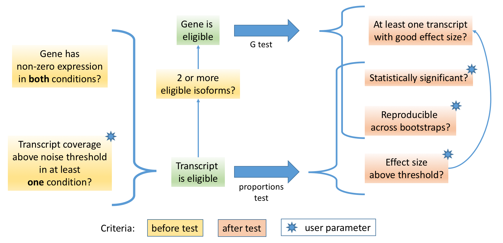

```{r setup, include=FALSE}
knitr::opts_chunk$set(echo = TRUE)
```

***

```{r}
library(rats)
```

***

# Input formats

## Data

RATs can work with any of three input types:

1. A [Sleuth](http://pachterlab.github.io/sleuth/) object.
2. Bootstrapped abundance estimates.
3. Abundance estimates.

-> [Sleuth](http://pachterlab.github.io/sleuth/) objects contain their input data, so RATs can extract the bootstrapped abundance estimates directly from there, 
for your convenience if Sleuth is in your workflow already.

-> Bootstrapped abundance estimates can be input directly as `list`s of `data.table`s. Two lists are needed, one per condition.
Each datatable should contain the transcript identifiers in the first column, followed by columns containing the estimates from the bootstrap iterations:

```{r, echo=FALSE}
# Show the first rows of the table corresponding to one sample, from simulated data.
head(sim_boot_data()[[2]][[1]])
```

-> Abundance estimates, without bootstrapping information, can be input simply as two `data.table`s, one per condition. The first column should
contain the transcript identifiers, followed by columns listing the abundance per sample. The format of each table is identical to the one shown above.


## Annotation

Regardless of data format, RATs also needs an annotation `data.frame` or `data.table` that matches transcript identifiers to gene identifiers. This looks like this:

```{r, echo=FALSE}
# Show the first rows of the table corresponding to the annotation, from simulated data.
head(sim_count_data()[[1]])
```

A function is provided to create this table, given a GTF file.
(**Note:** GFF3 is **not** supported, as the specification is too relaxed.)

```{r eval=FALSE}
# Extract transcript ID to gene ID index from a GTF annotation.
myannot <- annot2ids("my_annotation_file.gtf")
```


***


# Calling DTU 

To bypass the complexity of running third-party tools in this tutorial, we will instead use **emulated data**. RATs comes
with data emulators, intended to be used for testing the code. However, they are also convenient to use for showcasing
how RATs works. If you happen to have real data available, you can use that instead if you wish.

By default, RATs reports on its progress and produces a summary report.
The progress messages and summary can be suppressed by adding the `verbose = FALSE` parameter to the call. 
To prevent cluttering this tutorial with verbose output, we will use this option in all the examples.

If you leave `verbose = TRUE` when trying out the examples below using the emulated data, you will get **warnings**
about the number of bootstraps. The warning is triggered because the emulated dataset used in the examples immitates only the structure of 
real data, not the actual volume of it, and as such contains too few bootstrap iterations.


### from abundance estimates, without bootstraps

This is the simplest usage case, provided only for completeness. We recommend using bootstrapped data whenever possible,
for reasons that will be discussed in the relevant section below.

First, let's emulate some data to work with:

```{r}
# Simulate some data.
simdat <- sim_count_data()

# For convenience let's assign the contents of the list to separate variables.
mycond_A <- simdat[[2]]       # Simulated abundances for one condition.
mycond_B <- simdat[[3]]       # Simulated abundances for other condition.
myannot <- simdat[[1]]        # Transcript and gene IDs for the above data.
```

Now we can call DTU:

```{r}
# Find DTU between the simulated datasets.
mydtu <- call_DTU(annot= myannot, count_data_A= mycond_A, count_data_B= mycond_B, 
                  qboot=FALSE, verbose= FALSE,
                  name_A= "healthy", name_B= "patients", varname= "My phenotype",
                  description="Comparison of two simulated counts datasets for the
                    tutorial. Simulated using built-in functionality of RATs.")
```

`call_DTU()` takes 4 mandatory arguments for this input format:

1. An annotation data frame, as described in the *Input formats* section.
2. `qboot` must only take the value `FALSE` in this case, as no bootstrapped quantification data is available.
3. `count_data_A` and `count_data_B` are each a `data.table` of transcript abundances as described in the Input section.

`name_A`, `name_B`, `varname` and `description` are optional meta-data that will be recorded in the results object.


### from bootstrapped abundance estimates

First, let's emulate some data, as we did before.

```{r}
# Simulate some data. (Notice it is a different function than before.)
simdat <- sim_boot_data()

# For convenience let's assign the contents of the list to separate variables.
mycond_A <- simdat[[2]]       # Simulated bootstrapped data for one condition.
mycond_B <- simdat[[3]]       # Simulated bootstrapped data for other condition.
myannot <- simdat[[1]]        # Transcript and gene IDs for the above data.
```

Now we can call DTU:

```{r}
# Find DTU between conditions "controls" and "patients" in the simulated data.
mydtu <- call_DTU(annot= myannot, boot_data_A= mycond_A, boot_data_B= mycond_B, 
                  verbose= FALSE, 
                  name_A= "wildtype", name_B= "some mutant", varname = "My phenotype",
                  description="Comparison of two simulated datasets of bootstrapped 
                    counts for the tutorial. Simulated using built-in functionality 
                    of RATs.")
```

`call_DTU()` takes 3 mandatory arguments for this input format:

1. An annotation data frame, as described in the *Input formats* section.
2. `boot_data_A` and `boot_data_B` are each a list of `data.table` objects, as described in the Input section.

`name_A`, `name_B`, `varname` and `description` are optional meta-data that will be recorded in the results object.


### with a sleuth object

First, let's emulate a Sleuth object, using the bundled tools. The real Sleuth objects are very large and very complex nested lists. 
The emulated one contains only the minimum essential elements relevant to calling DTU with RATs. 

```{r}
# Simulate some data.
simdat <- sim_sleuth_data(cnames = c("controls", "patients")) 
# controls and patients are arbitrary names to use as conditions.

# For convenience let's assign the contents of the list to separate variables.
myslo <- simdat$slo       # Simulated minimal sleuth object.
myannot <- simdat$annot   # Transcript and gene Identifiers for the above data.
```

Now call DTU.

```{r}
# Find DTU between conditions "controls" and "patients" in the simulated data.
mydtu <- call_DTU(annot = myannot, slo = myslo, name_A = "controls", name_B = "patients", 
                  varname= "condition", verbose= FALSE,
                  description="Comparison of two conditions using a simulated sleuth object 
                    for the purposes of the tutorial. Simulated using built-in functionality 
                    of RATs.")
```

`call_DTU()` takes 5 mandatory arguments for this input format: 

1. an annotation data frame, as described in the *Input formats* section.
2. a Sleuth object.
3. `name_A` and `name_B` are restricted to values available in `myslo$sample_to_covariates`. The values must both exist in the column specified by `varname`.
4. `varname` must be an existing column header in `myslo$sample_to_covariates`.

`description` is optional meta-data that will be recorded in the results object.

Please note that, unlike the other two usage cases, `name_A`, `name_B` and `varname` are **not optional**, as they specify how data is extracted from the Sleuth object.


***


# Additional Parameters and Settings


In summary, `rats` works as follows:




## Thresholds

The following three main thresholds are used in RATs:

```{r eval=FALSE}
# Calling DTU with custom thresholds.
mydtu <- call_DTU(annot = myannot, slo = myslo, name_A = "controls", name_B = "patients", 
                  p_thresh = 0.01, abund_thresh = 10, dprop_thresh = 0.25)
```

1. `p_thresh` - Statistical significance level. P-values below this will be considered significant. Lower threshold values are stricter.
2. `abund_thresh` - Noise threshold. Transcripts with abundance below that value in both conditions are ignored. Higher threshold values are stricter.
3. `dprop_thresh` - Efect size threshold. Transcripts whose proportion changes between conditions by less than the threshold are considered non-DTU, regardless of their statistical significance.
Higher threshold values are stricter.

The default values for these thresholds are quite permissive. You may want to consider setting them to stricter values.
Depending on the settings, *additional thresholds* are available and will be discussed in their respective sections below.


## Bootstrapping 

RATs offers two types of bootstrapping:

1. Bootstrapping of `p-value` and `Dprop` against the technical fluctuations of the quantifications. This requires bootstrapped quantifications as input.
2. Bootstrapping of `p-value` and `Dprop` against the abundance fluctuations among samples.

Enabling these two procedures assesses the robustness of the DTU calls. Calls that are easily overturned depending on which subset of the data is used
may be spurious but may also be valid. Deeper sequencing and/or higher replication may resolve these ambiguities.

In both cases, what is measured is the fraction of iterations in which the significance and effect size meet their respective thresholds. 
These fractions can be used as indicators of confidence in the calls, especially when a large number of iterations is performed.

If bootstrapping is switched off, the respective output fields will not be included in the output.


### Quantification bootstraping

Three parameters control bootstrapping of DTU calls on the abundance estimates:

1. `qboot` - Whether to bootstrap the quantifications or not.
2. `qbootnum` - How many bootstrap iterations to do. Preferably at least 100. If 0, RATs will try to infer a value from the data.
3. `qrep_thresh` - Reproducibility threshold. What fraction of the iterations has to agree on a result to consider it confident. Higher threshold values are stricter.

In this process, one quantification iteration will be randomly selected from each sample and DTU will be called on it. This will be repeated `qbootnum` times. Because the
number of replicates remains the same, the statistical power is not compromised. Therefore, the reproducibility will be **used as a criterion** in calling DTU, along with
statistical significance and effect size. The process is **stochastic**; the quantifications are randomly sampled, so runs on the same data may yield slight differences in DTU. 
Using higher `qbootnum` improves reproducibility between runs on the same dataset.

Low reproducibility indicates that the quantification tool found it hard to distinguish these transcripts. This can be caused by high similarity of the isoforms, genes with a large
number of isoforms, and/or poor read coverage in the regions differentiating the isoforms from one another. In these cases, skepticism is required about the quantifications and any 
potential differential expression regarding these transcripts.

Warnings will be generated if `qbootnum` is too low or too high, but in most cases RATs will continue with the analysis. The warnings will not be shown if `verbose = FALSE`.

```{r eval=FALSE}
# Bootstrap (default). Do 100 iterations.
mydtu <- call_DTU(annot = myannot, slo = myslo, name_A = "controls", 
                  name_B = "patients", qboot = TRUE, qbootnum = 100, qrep_thresh= 0.95)

# Skip bootstraps.
mydtu <- call_DTU(annot = myannot, slo = myslo, name_A = "controls", 
                  name_B = "patients", qboot = FALSE)
```


### Replicate bootstraping

Three parameters control bootstrapping of DTU calls agaisnt the samples:

1. `rboot` - Whether to bootstrap the replicates or not.
2. `rrep_thresh` - Reproducibility threshold. What fraction of the iterations has to agree on a result to consider it confident. Higher threshold values are stricter.
3. `conservative` - Whether the replicate-wise reproducibility should be used as a criterion in calling DTU.

Unlike bootstrapping the quantifications, bootstrapping the replicates is currently **not stochastic**. RATs will do ALL the 1 vs 1 combinations of samples, one from each condition.
This behaviour assumes that most usage cases will have a relatively small number of replicates.

Because only one replicate is used each time, this process has reduced statistical power and only the strongest results will persist. Due to this, the sample-wise reproducibility
is **not used as a criterion** in calling DTU, unless explicitly required by setting the `conservative` flag. For low replication levels in particular, the reproducibility may
be easily underestimated or overestimated.

```{r eval=FALSE}
# Bootstrap (default). 
# NOTE: The number of iterations for 3 samples per condition is 3*3=9. 
# So the minimum possible error rate is 1/9=0.111. The corresponding threshold is 1-0.111=0.888.
mydtu <- call_DTU(annot = myannot, slo = myslo, name_A = "controls", 
                  name_B = "patients", rboot = TRUE, qrep_thresh= 0.85)

# Skip bootstraps.
mydtu <- call_DTU(annot = myannot, slo = myslo, name_A = "controls", 
                  name_B = "patients", rboot = FALSE)
```


## Multi-threading

RATs completion time depends on the number of expressed annotated transcripts. Single-threaded, RATs can take up to a few minutes per iteration for large annotations.
Fortunately, the task is highly parallelisable:

```{r eval=FALSE}
# Using 8 threads/cores for parallel computing.
mydtu <- call_DTU(annot = myannot, slo = myslo, name_A = "controls", 
                  name_B = "patients", threads = 8)
```

Due to core R implementation limitations, multi-threading works only in POSIX-compliant systems. In other systems, the option will be ignored and R will run serially.
Most Linux distros, Unix versions, and recent OSX versions are supposedly compatible, and there are environments that can be installed on Windows that might circumvent the issue.


## Test selection

RATs runs both gene-level calls and transcript-level calls. They are complementary and we recommend using them
together, but the option to skip either is provided for special use cases. The fields of the skipped test will be filled with `NA`.

```{r eval=FALSE}
# Transcripts only.
mydtu <- call_DTU(annot = myannot, slo = myslo, name_A = "controls", 
                  name_B = "patients", testmode="transc")
# Genes only.
mydtu <- call_DTU(annot = myannot, slo = myslo, name_A = "controls", 
                  name_B = "patients", testmode="genes")
```


## Correction for multiple testing

Testing multiple null hypotheses increases the chance of one being falsely rejected. To keep the overall false rate at the 
desired level, the raw p-values must be adjusted. The default adjustment 
method is `BH` (Benjamini-Hochberg). A full list of options is listed in R's `p.adjust.methods`.

```{r eval=FALSE}
# Bonferroni correction.
mydtu <- call_DTU(annot = myannot, slo = myslo, name_A = "controls", 
                  name_B = "patients", correction = "bonferroni")
```


## Input field names

RATs needs to pull information from different fields of the data and annotation and it does so based on the names of the columns. 
You can override the default names of these fields.


```{r}
# Lets emulate some input with custom field names. 
sim <- sim_sleuth_data(varname="mouse", cnames=c("Splinter", "Mickey"), 
                       COUNTS_COL="the-counts", TARGET_COL="transcript", 
                       PARENT_COL="gene", BS_TARGET_COL = "trscr")
myslo <- sim$slo
myannot <- sim$annot

# Sleuth covariates table.
print( sim$slo$sample_to_covariates )
# Sleuth bootstrapped quantifications.
print( head(sim$slo$kal[[1]]$bootstrap[[1]]) )
# Annotation.
print( head(sim$annot) )
```


### Sleuth field names

Although we expect Sleuth field names to be constant, with the exception of covariate names, RATs allows overriding the
expected names:

```{r, eval=FALSE}
# Call DTU on data with custom field names.
mydtu <- call_DTU(annot = myannot, slo = myslo, name_A = "Splinter", name_B = "Mickey", 
                  varname="mouse", COUNTS_COL="the-counts", BS_TARGET_COL="trscr", verbose = FALSE)

#! In our example data here, the annotation fields have been modified as well, so this command 
#! will NOT run as it is shown. You will also need the parameters shown in teh section below.
```

* `varname` - The field name in `myslo$sample_to_covariates` where the desired condition names are listed.
* `COUNTS_COL` - The name of the field holding the estimated counts in the Sleuth object's bootstrap tables.
* `BS_TARGET_COL` - The name of the field holding the transcript identifiers in the Sleuth object's bootstrap tables.


### Annotation field names

Although it is easy to rename the columns of a table to comply with the expected names, this may sometimes be undesireable, so RATs
allows you to change the expected names instead.

```{r, eval=FALSE}
# Call DTU using annotation with custom field names.
mydtu <- call_DTU(annot = myannot, slo = myslo, name_A = "Splinter", name_B = "Mickey", 
                  varname="mouse", TARGET_COL="transcript", PARENT_COL="gene", verbose = FALSE)

#! In our example data here, the Sleuth fields have been modified as well, so this command 
#! will NOT run as it is shown. You will also need the parameters shown in the section above.
```

* `TARGET_COL` - The name of the field holding the transcript identifiers in the annotation data frame.
* `PARENT_COL` - The name of the field holding the respective gene identifiers in the annotation data frame.


***


# Annotation discrepancies

Different annotation versions often preserve transcript IDs, despite altering the details of the transcript models,
such as UTRs. It is important to use the same annotation throught the workflow, especially for the quantifications.
Otherwise, the data is not comparable.

All internal operations and the output of RATs will be based on the annotation provided:

* Any transcripts present in the data but missing from the annotation will be ignored completely and 
will not show up in the output, as there is no reliable way to match them to gene IDs.
* Any transcript/gene present in the annotation but missing from the data will be included in the output as zero expression.
* If the samples appear to use different annotations from one another, RATs will abort.


***


# Contact information

The `rats` R package was developed within [The Barton Group](http://www.compbio.dundee.ac.uk) at [The University of Dundee](http://www.dundee.ac.uk)
by Dr. Kimon Froussios, Dr. Kira Mourão and Dr. Nick Schurch.

To **report problems** or **ask for assistance**, please raise a new issue [on the project's support forum](https://github.com/bartongroup/Rats/issues).
Providing a *reproducible working example* that demonstrates your issue is strongly encouraged to help us understand the problem. Also, be sure 
to **read the vignette(s)**, and browse/search the support forum before posting a new issue, in case your question is already answered there.

Enjoy!


