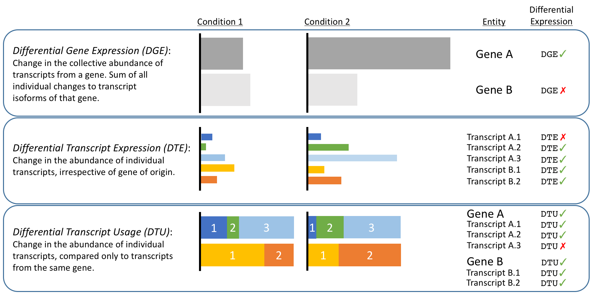
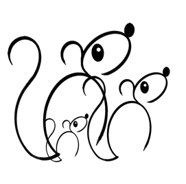

```{r setup, include=FALSE}
knitr::opts_chunk$set(echo = TRUE)
```


***

# Introduction

The `rats` R package aims to identify genes that show a shift in the relative abundance of their transcript isoforms 
between two conditions (*Differential Transcript Usage* -- **DTU**). This is supplementary
to identifying *Differential Transcript Expression* (**DTE**), which simply measures whether transcripts change in
abundance, but does not compare them to their sibling isoforms within each gene. Situations that show DTU are a 
subset of those that show DTE. The figure below shows the relationship between DTU and DTE, as well as between them and
*differential gene expression* (**DGE**):




**RATs is workflow-agnostic**. Quantification quality details are left to the quantification tools; RATs uses only the
transcript abundances. This makes it *suitable for use with alignment-free quantification tools* like [Kallisto](http://pachterlab.github.io/kallisto/)
or [Salmon](https://github.com/COMBINE-lab/salmon). It is also compatible with DTE output from [Sleuth](http://pachterlab.github.io/sleuth).

Additionally, RATs is able to take advantage of the bootstrapped quantifications provided by the alignment-free tools. These bootstrapped
data are used by `RATs to assess how much the technical variability of the heuristic quantifications affects differential transcript usage
and thus provide a measure of confidence in the DTU calls. 


***


# Install RATs

## Install dependencies first

`install.packages(c("data.table", "matrixStats", "ggplot2", "shiny"), dependencies=TRUE)`

If you have trouble installing these dependencies, your system could be missing source compilers for C and/or Fortran, and possibly other libraries, 
which you can see by scrolling back through the output to look for the errors. Please refer to the R manual and the documentations of these packages for help.

Strictly speaking, only `data.table` and `matrixStats` are needed for DTU calculations. `ggplot2` is needed only for plotting. We think plotting is very useful,
so we recommend installing it. `shiny` is needed only for a particular visualisation feature. Unless you plan to use that feature, `shiny` is not a required package. 


## Install the rats package

#### from Github

RATs is available as R source package from the project's [releases section](https://github.com/bartongroup/Rats/releases) on Github.
Download the latest release and then install it using:

`install.packages("<path/to/dowloaded/package>", repos = NULL, type="source")`

Release snapshots are labelled with even-ending version numbers (x.x.0/2/4/6/8).

#### through Bioconductor

Not available yet.

#### developmental version

The most current developmental version of `rats` can be installed directly from the working copy on Github, using the [devtools](https://www.rstudio.com/products/rpackages/devtools/) package 
(which you will need to install first):

`devtools::install_github("bartongroup/rats")`

As this version represents active development, it can change at any moment. Features may be added, removed or changed without notice. 
**Do not rely on this version for reproducible analysis of important data!**
A main reason to use the developmental version would be to test the resolution of bugs, or to give us feedback on the changes as they happen.
Developmental versions are labelled with odd-ending version numbers (x.x.1/3/5/7/9).


***


# Use RATs

RATs uses as input tables of transcript abundances with or without quantification bootstraps. For convenience, RATs can also
extract the transcript abundances from a Sleuth object. The latter option is shown below. For more details and settings, consult
the *Input & Parameters* vignette.

```{r eval=FALSE}
# 1. Load into R session.
library{rats}

# 2. Specify transcript grouping:
my_identifiers_table <- annot2ids("my_annotation.gtf")

# 3a. Call DTU on a sleuth object, using default settings:
mydtu <- call_DTU(annot= my_identifiers_table, slo= my_sleuth_object, 
                  name_A= "My_condition", name_B= "My_other_condition")
# 3b. Call DTU on generic bootstrapped abundance estimates:
mydtu <- call_DTU(annot= my_identifiers_table, boot_data_A= my_list_data_tables_A, 
                  boot_data_B= my_list_data_tables_A)
# 3c. Call DTU on generic abundance estimates:
mydtu <- call_DTU(annot= my_identifiers_table, count_data_A= my_data_table_A, 
                  count_data_B= my_data_table_B, qboots= FALSE)

# 4. Plot significance VS effect size:
plot_overview(mydtu)

# 5. Get all gene and transcript identifiers per category (significant DTU, 
# no DTU, Not Applicable):
myids <- get_dtu_ids(mydtu)

# 6. Plot isoform changes for a given gene.
plot_gene(mydtu, "my_awesome_gene_ID")
```


### Defaults

RATs provides default values for all its settings, however optimal threshold values will depend on the quantity, 
quality and biology of your data, so some trial and error may be required on your part. The current default values 
for the various threshold parameters are rather arbitrary and probably quite permissive. This means you are likely 
to get an inflated number of positive calls. The available thresholds and settings are discussed in the *Input & Parameters* vignette.


***


# Contact information

The `rats` R package was developed within [The Barton Group](http://www.compbio.dundee.ac.uk) at [The University of Dundee](http://www.dundee.ac.uk)
by Dr. Kimon Froussios, Dr. Kira Mourão and Dr. Nick Schurch.

To **report problems** or **ask for assistance**, please raise a new issue [on the project's support forum](https://github.com/bartongroup/Rats/issues).
Providing a *reproducible working example* that demonstrates your issue is strongly encouraged to help us understand the problem. Also, be sure 
to **read the vignette(s)**, and browse/search the support forum before posting a new issue, in case your question is already answered there.

Enjoy!



