# RATs Tutorial
Kimon Froussios  
`r date()`  


# Relative Abundance of Transcripts (RATs).

The `rats` package aims to identify genes that show a shift in the relative abundance of their transcript isoforms 
between two conditions (*Differential Transcript Usage* -- **DTU**). This is supplementary
to identifying *Differential Transcript Expression* (**DTE**), which simply measures whether transcripts change in
abundance, but does not compare them to their sibling isoforms within each gene. Situations that show DTU are a 
subset of those that show DTE. The figure below shows the relationship between DTU and DTE, as well as between them and
*differential gene expression* (**DGE**):


# Quick start.


```r
# 1. Build from Github:
install_github("bartongroup/rats")

# 2. Load into R session.
library{rats}

# 3. Call DTU on a sleuth object, using default thresholds.
mydtu <- call_DTU(my_sleuth_object, my_identifiers_table, "My_condition", "My_other_condition")

# 4. Tally of results.
dtu_summary(mydtu)

# 5. Get all gene and transcript identifiers that correspond to the above tally.
myids <- get_dtu_ids(mydtu)
# A list of vectors, one for each category of the tally.

# 6. Plot significance VS effect size.
plot_overview(mydtu)
```

`my_identifiers_table`: An annotation `data.frame` with two columns, matching the transcript identifiers to 
the respective gene identifiers.

Tally categories:

* DTU - significant change in proportions.
* non-DTU - no significant changes.
* NA - The tests were not applicable (due to low/no fragment counts or lack of alternative transcripts).

The input and output structures and the command options are discussed in more detail in the rest of this tutorial.


# Installation and loading

### Install latest release

#### from Github

Available in source form from the [releases section](https://github.com/bartongroup/Rats/releases) on Github.
Download the latest release and then install it using:

`install.packages("<path/to/dowloaded/package>", repos = NULL, type="source")`

You can also install a release directly from the repository like so (just edit the release details):

`install.packages("http://github.com/bartongroup/Rats/releases/download/v0.1-alpha.1/rats_0.1.tar.gz", repos = NULL, type="source")`


#### through Bioconductor

Not available yet.


### Install latest developmental version from Github

The most current `rats` can be installed directly, using the [devtools](https://www.rstudio.com/products/rpackages/devtools/) package:

`devtools::install_github("bartongroup/rats")`

This way might not install the vignettes and the version may also contain more bugs.


### Loading

Once installed, rats is imported into your r session as normal:


```r
library(rats)
```

# The package in detail

## Input

The input format recognised by `rats` is the output of [Sleuth](http://pachterlab.github.io/sleuth/). See the 
[introduction to Sleuth](http://rawgit.com/pachterlab/sleuth/master/inst/doc/intro.html) pages for details on how 
to load the transcript abundance estimate data from [Kallisto](http://pachterlab.github.io/kallisto/) into a sleuth 
object, and see the [wasabi](http://github.com/COMBINE-lab/wasabi) tool for how to load the transcript abundance 
estimate data from [Sailfish](http://github.com/kingsfordgroup/sailfish) or [Salmon](https://github.com/COMBINE-lab/salmon) 
into a sleuth object.

To bypass the complexity of running these third-party tools in this tutorial, we will instead use simulated data. `rats` comes
with data simulators, intended to be used for testing the code. However, they are also convenient to use for showcasing
how `rats` works.


```r
# Simulate some data.
simdat <- sim_sleuth_data(cnames = c("foo", "bar")) # foo and bar are arbitrary names 
                                                    # to use as conditions.

# For convenience let's assign the contents of the list to separate variables.
slo <- simdat$slo       # Simulated minimal sleuth object.
annot <- simdat$annot   # Transcript and gene Identifiers for the above data.
```

* The main piece of data that `rats` requires is a [Sleuth](http://pachterlab.github.io/sleuth/) object. `slo` emulates 
this object. The real sleuth objects are quite large and very complex nested lists. The simulated one contains only 
the essential parts relevant to calling DTU with `rats`. It has a couple of bootstraps of transcript 
abundance estimates, for a handful of made-up genes, in two conditions.


```r
# This table is important. It assigns samples to variables. We can only compare data based on the 
# variables and values listed in this table.
# This one has two variables: "condition" and "batch". Yours may have more/fewer/different ones.
# Notice that "foo" and "bar" (the names we gave to our simulated data) are under "condition".
print( slo$sample_to_covariates )
```

```
##   condition batch
## 1       foo    ba
## 2       bar    ba
## 3       foo    bb
## 4       bar    bb
```

```r
# This is what the estimated counts tables look like. One such table per bootstrap, per sample.
# head() shows the first few rows only.
print( head(slo$kal[[1]]$bootstrap[[1]]) )
```

```
##   target_id est_counts
## 1       LC1          3
## 2      NIA1        333
## 3      NIA2        666
## 4    1A1N-1         10
## 5    1A1N-2         20
## 6  1D1C:one          0
```

* The other piece of data required by `rats` is a dataframe that matches transcript identifiers to gene identifiers.
For the simulated data we created, the generator also provided us with the respective annotation table, `annot`.
When working with your own data, you will have to create and provide your own such table that is appropriate for
the data contained in the sleuth object.


```r
# This is what the annotation table should look like.
# head() shows the first few rows only.
print( head(annot) )
```

```
##   target_id parent_id
## 1     NIB.1       NIB
## 2    1A1N-2      1A1N
## 3  1D1C:one      1D1C
## 4  1D1C:two      1D1C
## 5    1B1C.1      1B1C
## 6    1B1C.2      1B1C
```


## Calling DTU

With our simulated sleuth object and annotation at hand (or your real data, if you have any readily available), 
we can now call DTU using `rats`. We will use default parameter values for everything. For details on
what parameters are available and how to use them, refer to the "Advanced input options" section.


```r
# Find DTU between conditions "foo" and "bar" in the simulated data.
# Be warned that the vignette format does not display progress bars properly!
mydtu <- call_DTU(slo, annot, "foo", "bar")
```

```
## Checking parameters...
```

```
## Creating look-up structures...
```

```
## Extracting estimated counts from bootstraps...
```

```
## Calculating significances...
```

```
## Filling in info and descriptive statistics...
```

```
## Bootstrapping...
```

```
## 
  |                                                                       
  |                                                                 |   0%
  |                                                                       
  |=                                                                |   1%
  |                                                                       
  |=                                                                |   2%
  |                                                                       
  |==                                                               |   3%
  |                                                                       
  |===                                                              |   4%
  |                                                                       
  |===                                                              |   5%
  |                                                                       
  |====                                                             |   6%
  |                                                                       
  |=====                                                            |   7%
  |                                                                       
  |=====                                                            |   8%
  |                                                                       
  |======                                                           |   9%
  |                                                                       
  |======                                                           |  10%
  |                                                                       
  |=======                                                          |  11%
  |                                                                       
  |========                                                         |  12%
  |                                                                       
  |========                                                         |  13%
  |                                                                       
  |=========                                                        |  14%
  |                                                                       
  |==========                                                       |  15%
  |                                                                       
  |==========                                                       |  16%
  |                                                                       
  |===========                                                      |  17%
  |                                                                       
  |============                                                     |  18%
  |                                                                       
  |============                                                     |  19%
  |                                                                       
  |=============                                                    |  20%
  |                                                                       
  |==============                                                   |  21%
  |                                                                       
  |==============                                                   |  22%
  |                                                                       
  |===============                                                  |  23%
  |                                                                       
  |================                                                 |  24%
  |                                                                       
  |================                                                 |  25%
  |                                                                       
  |=================                                                |  26%
  |                                                                       
  |==================                                               |  27%
  |                                                                       
  |==================                                               |  28%
  |                                                                       
  |===================                                              |  29%
  |                                                                       
  |====================                                             |  30%
  |                                                                       
  |====================                                             |  31%
  |                                                                       
  |=====================                                            |  32%
  |                                                                       
  |=====================                                            |  33%
  |                                                                       
  |======================                                           |  34%
  |                                                                       
  |=======================                                          |  35%
  |                                                                       
  |=======================                                          |  36%
  |                                                                       
  |========================                                         |  37%
  |                                                                       
  |=========================                                        |  38%
  |                                                                       
  |=========================                                        |  39%
  |                                                                       
  |==========================                                       |  40%
  |                                                                       
  |===========================                                      |  41%
  |                                                                       
  |===========================                                      |  42%
  |                                                                       
  |============================                                     |  43%
  |                                                                       
  |=============================                                    |  44%
  |                                                                       
  |=============================                                    |  45%
  |                                                                       
  |==============================                                   |  46%
  |                                                                       
  |===============================                                  |  47%
  |                                                                       
  |===============================                                  |  48%
  |                                                                       
  |================================                                 |  49%
  |                                                                       
  |================================                                 |  50%
  |                                                                       
  |=================================                                |  51%
  |                                                                       
  |==================================                               |  52%
  |                                                                       
  |==================================                               |  53%
  |                                                                       
  |===================================                              |  54%
  |                                                                       
  |====================================                             |  55%
  |                                                                       
  |====================================                             |  56%
  |                                                                       
  |=====================================                            |  57%
  |                                                                       
  |======================================                           |  58%
  |                                                                       
  |======================================                           |  59%
  |                                                                       
  |=======================================                          |  60%
  |                                                                       
  |========================================                         |  61%
  |                                                                       
  |========================================                         |  62%
  |                                                                       
  |=========================================                        |  63%
  |                                                                       
  |==========================================                       |  64%
  |                                                                       
  |==========================================                       |  65%
  |                                                                       
  |===========================================                      |  66%
  |                                                                       
  |============================================                     |  67%
  |                                                                       
  |============================================                     |  68%
  |                                                                       
  |=============================================                    |  69%
  |                                                                       
  |==============================================                   |  70%
  |                                                                       
  |==============================================                   |  71%
  |                                                                       
  |===============================================                  |  72%
  |                                                                       
  |===============================================                  |  73%
  |                                                                       
  |================================================                 |  74%
  |                                                                       
  |=================================================                |  75%
  |                                                                       
  |=================================================                |  76%
  |                                                                       
  |==================================================               |  77%
  |                                                                       
  |===================================================              |  78%
  |                                                                       
  |===================================================              |  79%
  |                                                                       
  |====================================================             |  80%
  |                                                                       
  |=====================================================            |  81%
  |                                                                       
  |=====================================================            |  82%
  |                                                                       
  |======================================================           |  83%
  |                                                                       
  |=======================================================          |  84%
  |                                                                       
  |=======================================================          |  85%
  |                                                                       
  |========================================================         |  86%
  |                                                                       
  |=========================================================        |  87%
  |                                                                       
  |=========================================================        |  88%
  |                                                                       
  |==========================================================       |  89%
  |                                                                       
  |==========================================================       |  90%
  |                                                                       
  |===========================================================      |  91%
  |                                                                       
  |============================================================     |  92%
  |                                                                       
  |============================================================     |  93%
  |                                                                       
  |=============================================================    |  94%
  |                                                                       
  |==============================================================   |  95%
  |                                                                       
  |==============================================================   |  96%
  |                                                                       
  |===============================================================  |  97%
  |                                                                       
  |================================================================ |  98%
  |                                                                       
  |================================================================ |  99%
  |                                                                       
  |=================================================================| 100%
```

```
## Summarising bootstraps...
```

```
## All done!
```

```
##           DTU genes       non-DTU genes            NA genes 
##                   2                   1                   7 
##     DTU transcripts non-DTU transcripts      NA transcripts 
##                   5                   5                  11
```

`call_DTU()` takes 4 mandatory arguments: 

1. a sleuth object
2. an annotation dataframe matching transcripts to genes
3. the names of two conditions to compare. 

The summary report has 3 categories for each of genes and transcripts:

* DTU - significant change in proportions.
* non-DTU - no significant changes.
* NA - The tests were not applicable (due to low/no fragment counts or lack of alternative transcripts).

By default, the two condition names (in our example, "foo" and "bar") are expected to be values found 
in the "condition" column of the `slo$sample_to_conditions` table. You can override this if you want 
to compare by a different variable. For example, our simulated data has a variable called "batch", 
with values "ba" and "bb":


```r
# Comparing samples by a different variable.
mydtu <- call_DTU(slo, annot, "ba", "bb", varname="batch")
```

By default, `rats` reports its progress and gives you the summary at the end. You can
also choose to suppress all these reports:


```r
# This prints out nothing at all.
mydtu <- call_DTU(slo, annot, "foo", "bar", verbose = FALSE)
```

In reality, the progress bar is displayed much more sensibly, in a single row. The clutter
seen in the example above is an artefact of how vignettes capture output.


## Quick results

For your convenience, `rats` provides a couple of functions to give you a quick summary of your results.
However, we do recommend you become familiar with the actual results structure and content, so that you
can judge the quality of the DTU calls and trace the reasons behind the classification of each identifier.

The `dtu_summary()` function lists the number of genes and transcripts for each of the following 3 categories:

* DTU:  There is significant change in relative transcript abundance.
* non-DTU:  No significant change.
* NA:  Not applicable. Genes/transcripts with no/low fragment counts, or where the gene has only one transcript.


```r
# A really simple tally of the outcome.
print( dtu_summary(mydtu) )
```

```
##           DTU genes       non-DTU genes            NA genes 
##                   2                   1                   7 
##     DTU transcripts non-DTU transcripts      NA transcripts 
##                   5                   5                  11
```

The `get_dtu_ids()` function lists the actual identifiers per category, instead of the numbers in each category.
The categories are the same as those in `dtu_summary()` above.


```r
# Gene and transcript IDs corresponding to the tally above.
ids <- get_dtu_ids(mydtu)

# Contents
print( names(ids) )
```

```
## [1] "dtu-genes"   "dtu-transc"  "ndtu-genes"  "ndtu-transc" "na-genes"   
## [6] "na-transc"
```

```r
# DTU positive genes.
print( ids[["dtu-genes"]] )
```

```
## [1] "CC"   "MIX6"
```


## Output structure

### Parameters

`Parameters` is a list that contains information about the data and the settings.


```r
# Parameter list's elements.
print( names(mydtu$Parameters) )
```

```
##  [1] "var_name"     "cond_A"       "cond_B"       "num_replic_A"
##  [5] "num_replic_B" "p_thresh"     "count_thresh" "dprop_thresh"
##  [9] "tests"        "bootstrap"    "bootnum"
```

1. `var_name` - The name of the variable by which the samples were grouped. This is a column name in the `slo$sample_to_covariates` table.
2. `cond_A` and `cond_B` - The names of the two groups of samples to compare. These are values of the column specified above.
3. `num_replic_A` and `num_replic_B` - The number of samples in each group.
4. `p_thresh` - The significance level at which DTU is called, applicable to both tests.
5. `count_thresh` - The minimum required fragment count per sample for each transcript.
6. `dprop_thresh` - The minimum difference in proportion that is considered biologically significant.
7. `tests` - Which of the two tests (gene-wise, transcript-wise) were carried out.
8. `bootstrap` - Which of the two tests (gene-wise, transcript-wise) was bootstrapped.
9. `bootnum` - The number of bootstrap iterations.

### Genes

`Genes` is a [data.table](https://cran.r-project.org/web/packages/data.table/) with many fields, listing 
results at the gene level. For your convenience, the transcript-level DTU calls are also summarised here.

The G-test is used for gene-level calls. *As the test is designed for comparison of a set of counts
against a **theoretical** set of proportions and, instead, we have two sets of counts, the test is run using
in turn each condition as reference for the proportions.* Thus, the table conatains two sets of results,
marked with the "AB" and "BA" suffixes. Due to the nature of the test, it is not possible to attribute 
the change to specific transcripts within the gene, but in return the test has a lower detection threshold and 
will pick up smaller changes.


```r
# Genes table's fields.
print( names(mydtu$Genes) )
```

```
##  [1] "parent_id"     "DTU"           "transc_DTU"    "known_transc" 
##  [5] "detect_transc" "elig_transc"   "elig"          "elig_fx"      
##  [9] "pvalAB"        "pvalBA"        "pvalAB_corr"   "pvalBA_corr"  
## [13] "sig"           "boot_freq"     "boot_meanAB"   "boot_meanBA"  
## [17] "boot_stdevAB"  "boot_stdevBA"  "boot_minAB"    "boot_minBA"   
## [21] "boot_maxAB"    "boot_maxBA"    "boot_na"
```

1. `parent_id` - The identification name/code of the gene.
2. `DTU` - The gene collectively shows DTU, according to the gene-wise test. It is not possible to attribute 
this to specific transcripts. To be DTU, a gene needs both biological and statistical significance: `DTU = (sig & elig_fx)`.
3. `transc_DTU` - Aggregated from `Transcript$DTU`. Signifies that at least one transcript has changed significantly 
according to the transcript-wise test. Look up the gene in the `Transcripts` table to see which transcripts are responsible.
4. `known_transc` - The number of annotated transcripts for the gene.
5. `detect_transc` - The number of transcripts with non-zero expression in at least one of the two conditions. 
`known_transc >= detect_transc`.
6. `elig_transc` - The number of transcripts eligible for DTU calling. `detect_transc >= elig_transc`. See the 
`Transcripts` table info below for details on how these are determined.
7. `elig` - Eligible for testing: By definition, a gene needs at least 2 eligible transcripts in order for DTU to even be
possible.
8. `elig_fx` - Eligible effect size: At least one of the transcripts shows eligible effect size
(see `Transcripts` table explanations).
9. `pvalAB` and `pvalBA` - The raw P-values from the G tests, using in turn each condition as reference.
10. `pvalAB_corr` and `pvalBA_corr` - The above P-values adjusted for multiple testing (number of tested genes).
11. `sig` - Statistically significant: `pvalAB_corr < Parameters$p_thresh  &  pvalBA_corr < Parameters$p_thresh`.
12. `boot_freq` - The fraction of bootstrap iterations in which the gene was called DTU. It can be used as a 
measure of confidence in the DTU call. Values closer to `1` indicate strong tendency for DTU, whereas values 
nearer `0` indicate lack of DTU. Values near `0.5` indicate lack of confidence either way and should be treated 
carefully.
13. `boot_meanAB` and `boot_meanBA` - Mean P-values across the bootstraps.
14. `boot_stdevAB` and `boot_stdevBA` - Standard deviations of the mean P-values across the bootstraps.
15. `boot_minAB` and `boot_minBA` - The minimum (=most significant) P-values that occurred in the bootstraps.
16. `boot_maxAB` and `boot_maxBA` - The maximum (=least significant) P-values that occurred in the bootstraps.
17. `boot_na` - The fraction of bootstrap iterations in which the gene was not eligible for DTU calling.

**Note:** The fields reporting on the bootstraps will not be shown when bootstrapping is disabled.

### Transcripts

`Transcripts` is a [data.table](https://cran.r-project.org/web/packages/data.table/) with many fields, listing 
results at the transcript level. For your convenience, the gene-level DTU calls are also included here.

The proportions test is used for the transcript-level calls. Changes can be attributed to specific transcripts,
but, as it uses less information, the test has a higher detection threshold and requires larger changes than the gene-level test.


```r
# Transcripts table's fields.
print( names(mydtu$Transcripts) )
```

```
##  [1] "target_id"  "parent_id"  "DTU"        "gene_DTU"   "meanA"     
##  [6] "meanB"      "stdevA"     "stdevB"     "sumA"       "sumB"      
## [11] "totalA"     "totalB"     "elig_xp"    "elig"       "propA"     
## [16] "propB"      "Dprop"      "elig_fx"    "pval"       "pval_corr" 
## [21] "sig"        "boot_freq"  "boot_mean"  "boot_stdev" "boot_min"  
## [26] "boot_max"   "boot_na"
```

1. `target_id` and `parent_id` - The identification name/code of the transcript and gene, respectively.
2. `DTU` - Whether the transcript's proportion changed significantly, according to the transcript-wise test.
3. `gene_DTU` - Expanded from `Genes$DTU`. Indicates that the gene as a whole shows significant change in proportions.
4. `meanA` and `meanB` - The mean of counts across samples, for each condition.
5. `stdevA` and `stdevB` - The standard deviation of the mean counts across samples, for each condition.
6. `sumA` and `sumB` - The sum of counts across samples for each condition. This is used for the tests, so that a 
higher number of samples leads to higher significance.
7. `totalA` and `totalB` - The total counts for the gene. `totalA = sum(sumA)  # by gene`.
8. `elig_xp` - Eligible expression level: A fragment count above the defined threshold in at least one of the two 
conditions is required. `elig_xp = (meanA > Parameters$count_thresh | meanB > Parameters$count_thresh)`.
9. `elig` - Eligible for testing: A transcript needs to meet the eligible expression level and its gene needs to have 
more than one eligible expression transcripts (by DTU definition), and finally the gene as a whole needs to have detectable 
expression in **both** conditions (otherwise the proportion cannot be defined). `elig = (elig_xp & totalA != 0 & totalB != 0 & (sumA != totalA | sumB != totalB))`
10. `propA` and `propB` - The proportion of the gene expression owed to this transcript, in each condition.
11. `Dprop` - The difference in the proportion of the transcript between the two conditions.
12. `elig_fx` - Eligible effect size: Proxy for biological significance. Meaninglessly small changes in the
proportion can be statistically significant if transcript expression or sequencing depth are very high.
`elig_fx = (Dprop > Parameters$dprop_thresh)`.
13. `pval` - The raw P-value of the proportions test for the transcript.
14. `pval_corr` - The above P-value adjusted for multiple testing (number of transcripts).
15. `sig` - Statistically significant: `pval_corr < Parameters$p_thresh`.
16. `boot_freq` - The fraction of bootstrap iterations in which the transcript was called DTU. It can be used as 
a measure of confidence in the DTU call. Values closer to `1` indicate strong tendency for DTU, whereas values 
nearer `0` indicate lack of DTU. Values near `0.5` indicate lack of confidence either way and should be treated 
carefully.
17. `boot_mean` - The mean P-value across the bootstraps.
18. `boot_stdev` - The standard deviation of the mean P-value across the bootstraps.
19. `boot_min` - The minimum (most significant) P-value that occurred in the bootstraps.
20. `boot_max` - The maximum (most significant) P-value that occurred in the bootstraps.
21. `boot_na` - The fraction of bootstrap iterations in which the transcripts were not eligible for DTU calling.

**Note** The fields reporting on the bootstraps will not be shown when bootstrapping is disabled.


## Example results

Now that you know what all the fields are, let's see how they apply to our simulated data.


```r
# Let's check the info and settings.
print( mydtu$Parameters )
```

```
## $var_name
## [1] "condition"
## 
## $cond_A
## [1] "foo"
## 
## $cond_B
## [1] "bar"
## 
## $num_replic_A
## [1] 2
## 
## $num_replic_B
## [1] 2
## 
## $p_thresh
## [1] 0.05
## 
## $count_thresh
## [1] 5
## 
## $dprop_thresh
## [1] 0.1
## 
## $tests
## [1] "both"
## 
## $bootstrap
## [1] "both"
## 
## $bootnum
## [1] 100
```

* We're comparing samples by "condition", and the two values of that are "foo" 
(with 2 samples) and "bar" (with 2 
samples). 
* The significance threshold is set to 0.05, the minimum count per sample is set to 
5 fragments and the proportion has to change by at least 0.1 
to be considered biologically significant.
* Are we doing gene-level or transcript-level tests? both
* Are we bootstrapping the gene-level or transcript-level tests? both. And we're 
doing 100 iterations.


```r
# Gene-level calls.
print( mydtu$Genes )
```

```
##     parent_id   DTU transc_DTU known_transc detect_transc elig_transc
##  1:      1A1N    NA         NA            1             1           0
##  2:      1B1C    NA         NA            2             1           0
##  3:      1D1C    NA         NA            2             1           0
##  4:      ALLA    NA         NA            1             1           0
##  5:      ALLB    NA         NA            2             2           0
##  6:        CC  TRUE       TRUE            2             2           2
##  7:        LC    NA         NA            2             2           1
##  8:      MIX6  TRUE       TRUE            6             5           5
##  9:       NIB    NA         NA            1             0           0
## 10:        NN FALSE      FALSE            2             2           2
##      elig elig_fx      pvalAB       pvalBA pvalAB_corr  pvalBA_corr   sig
##  1: FALSE   FALSE          NA           NA          NA           NA    NA
##  2: FALSE   FALSE          NA           NA          NA           NA    NA
##  3: FALSE   FALSE          NA           NA          NA           NA    NA
##  4: FALSE      NA          NA           NA          NA           NA    NA
##  5: FALSE      NA          NA           NA          NA           NA    NA
##  6:  TRUE    TRUE 0.000789622 0.0001903606 0.001184433 0.0002855408  TRUE
##  7: FALSE    TRUE          NA           NA          NA           NA    NA
##  8:  TRUE    TRUE 0.000000000 0.0000000000 0.000000000 0.0000000000  TRUE
##  9: FALSE      NA          NA           NA          NA           NA    NA
## 10:  TRUE   FALSE 0.823492782 0.7570669089 0.823492782 0.7570669089 FALSE
##     boot_freq boot_meanAB  boot_meanBA boot_stdevAB boot_stdevBA
##  1:        NA          NA           NA           NA           NA
##  2:        NA          NA           NA           NA           NA
##  3:        NA          NA           NA           NA           NA
##  4:        NA          NA           NA           NA           NA
##  5:        NA          NA           NA           NA           NA
##  6:      0.78 0.002832138 0.0008932865  0.003955343  0.001352966
##  7:        NA          NA           NA           NA           NA
##  8:      1.00 0.000000000 0.0000000000  0.000000000  0.000000000
##  9:        NA          NA           NA           NA           NA
## 10:      0.00 0.787081394 0.7065362102  0.143215212  0.200313461
##       boot_minAB   boot_minBA boot_maxAB boot_maxBA boot_na
##  1:           NA           NA         NA         NA      NA
##  2:           NA           NA         NA         NA      NA
##  3:           NA           NA         NA         NA      NA
##  4:           NA           NA         NA         NA      NA
##  5:           NA           NA         NA         NA      NA
##  6: 5.030128e-05 1.550451e-05  0.0154553 0.00480727       0
##  7:           NA           NA         NA         NA      NA
##  8: 0.000000e+00 0.000000e+00  0.0000000 0.00000000       0
##  9:           NA           NA         NA         NA      NA
## 10: 5.143483e-01 3.311102e-01  0.9915083 0.98871978       0
```

There are 10 genes in the annotation used. Here are some possible scenarios:

* `1A1N` has only one known transcript and is thus not eligible. If you look in `slo$kal[[1]]$bootstrap[[1]]`, there 
are actually two recorded transcripts for this gene, but only one of them is recorded in the annotation. `rats` uses 
the annotation as the basis for managing information. Any transcripts/genes present in the sleuth data, but missing from 
the annotation, will be ignored completely.
* `1B1C` has two annotated transcripts. If you look in `slo$kal[[1]]$bootstrap[[1]]`, only one of them is recorded in 
our data whereas the other is missing completely, so the gene does not have enough transcripts to be eligible.
* `1D1C` has two transcripts, but only one was detected in our data, so it too is not eligible. Both transcript are 
present in the sleuth data, but one of them has zero counts in both conditions. Thus this gene is also not eligible. 
* `CC` has two known transcripts, both of which are detected and eligible, therefore it is eligible for DTU. It is 
called as DTU on both the transcript and gene levels, with very high significances. The bootstraps show that the calls
were not 100% positive, so there is a small level of uncertainty regarding this gene.
* `LC` has two known transcripts, both of which are detected but only one of them is eligible, so it is not eligible for 
testing at the gene level. An inspection of the `Transcripts` table shows that the reason is that one of the two 
transcripts does not meet the minimum fragment count requirement.
* `MIX6` has six transcripts, 5 of which are detected and eligible. The gene is called as DTU with extremely high 
significance and all the bootstrap iterations were positive. Inspection of the `Transcripts` table shows that the 
missing transcript is not detected in either condition.
* `NIB`  has a single transcript that is not detected. Looking into `slo$kal[[1]]$bootstrap[[1]]` it is evident that 
the entire gene is not recorded at all in the data.
* `NN` has two transcripts, both of which are detected and eligible, but no significant change is detected, a result
backed up by all the bootstrap iterations.
* `ALLA` has one transcript and it is detected in only one of the conditions, but one transcript is not enough to be eligible.
* `ALLB` has two transcripts, both detected, yet is still not eligible as both transcripts are not eligible. Inspection of
`Transcripts` shows that neither transcript is  detected in one of the conditions. Although the gene would likely be called as
DTE and DGE by the appropriate tools, it is not possible to define proportions in that condition, so it is not possible 
to call DTU for it.

**Note:** The values shown in the bootstrap columns will differ in each run of the same command, especially for few iterations,
due to random sampling.


```r
# Transcript-level calls.
print( mydtu$Transcripts )
```

```
##     target_id parent_id   DTU gene_DTU      meanA      meanB    stdevA
##  1:    1A1N-2      1A1N    NA       NA  20.083333  22.250000 0.5892557
##  2:    1B1C.1      1B1C    NA       NA   0.000000   0.000000 0.0000000
##  3:    1B1C.2      1B1C    NA       NA  52.916667 153.333333 0.8249579
##  4:  1D1C:one      1D1C    NA       NA   0.000000   0.000000 0.0000000
##  5:  1D1C:two      1D1C    NA       NA  77.000000  23.333333 1.4142136
##  6:     ALLA1      ALLA    NA       NA  47.500000   0.000000 3.5355339
##  7:     ALLB1      ALLB    NA       NA   0.000000 120.000000 0.0000000
##  8:     ALLB2      ALLB    NA       NA   0.000000 217.500000 0.0000000
##  9:      CC_a        CC  TRUE     TRUE  22.500000  19.250000 2.1213203
## 10:      CC_b        CC  TRUE     TRUE  53.916667  86.166667 5.0675986
## 11:       LC1        LC    NA       NA   2.583333   2.583333 1.2963624
## 12:       LC2        LC FALSE       NA   4.416667   8.333333 0.1178511
## 13:   MIX6.c1      MIX6  TRUE     TRUE 123.333333 322.583333 0.9428090
## 14:   MIX6.c2      MIX6  TRUE     TRUE 321.250000 126.333333 1.0606602
## 15:   MIX6.c3      MIX6 FALSE     TRUE   0.000000  43.500000 0.0000000
## 16:   MIX6.c4      MIX6  TRUE     TRUE 101.500000   0.000000 0.7071068
## 17:    MIX6.d      MIX6    NA     TRUE   0.000000   0.000000 0.0000000
## 18:   MIX6.nc      MIX6 FALSE     TRUE  31.583333  32.250000 0.1178511
## 19:     NIB.1       NIB    NA       NA   0.000000   0.000000 0.0000000
## 20:       1NN        NN FALSE    FALSE   9.250000  18.416667 1.0606602
## 21:       2NN        NN FALSE    FALSE  29.000000  54.416667 0.0000000
##     target_id parent_id   DTU gene_DTU      meanA      meanB    stdevA
##         stdevB       sumA       sumB     totalA     totalB elig_xp  elig
##  1:  0.3535534  40.166667  44.500000   40.16667   44.50000    TRUE FALSE
##  2:  0.0000000   0.000000   0.000000  105.83333  306.66667   FALSE FALSE
##  3:  2.3570226 105.833333 306.666667  105.83333  306.66667    TRUE FALSE
##  4:  0.0000000   0.000000   0.000000  154.00000   46.66667   FALSE FALSE
##  5:  0.9428090 154.000000  46.666667  154.00000   46.66667    TRUE FALSE
##  6:  0.0000000  95.000000   0.000000   95.00000    0.00000    TRUE FALSE
##  7: 14.1421356   0.000000 240.000000    0.00000  675.00000    TRUE FALSE
##  8: 10.6066017   0.000000 435.000000    0.00000  675.00000    TRUE FALSE
##  9:  2.4748737  45.000000  38.500000  152.83333  210.83333    TRUE  TRUE
## 10:  1.6499158 107.833333 172.333333  152.83333  210.83333    TRUE  TRUE
## 11:  1.2963624   5.166667   5.166667   14.00000   21.83333   FALSE FALSE
## 12:  0.4714045   8.833333  16.666667   14.00000   21.83333    TRUE  TRUE
## 13:  0.1178511 246.666667 645.166667 1155.33333 1049.33333    TRUE  TRUE
## 14:  5.1854497 642.500000 252.666667 1155.33333 1049.33333    TRUE  TRUE
## 15:  2.1213203   0.000000  87.000000 1155.33333 1049.33333    TRUE  TRUE
## 16:  0.0000000 203.000000   0.000000 1155.33333 1049.33333    TRUE  TRUE
## 17:  0.0000000   0.000000   0.000000 1155.33333 1049.33333   FALSE FALSE
## 18:  1.0606602  63.166667  64.500000 1155.33333 1049.33333    TRUE  TRUE
## 19:  0.0000000   0.000000   0.000000    0.00000    0.00000   FALSE FALSE
## 20:  1.2963624  18.500000  36.833333   76.50000  145.66667    TRUE  TRUE
## 21:  2.7105760  58.000000 108.833333   76.50000  145.66667    TRUE  TRUE
##         stdevB       sumA       sumB     totalA     totalB elig_xp  elig
##          propA      propB        Dprop elig_fx         pval    pval_corr
##  1: 1.00000000 1.00000000  0.000000000   FALSE           NA           NA
##  2: 0.00000000 0.00000000  0.000000000   FALSE           NA           NA
##  3: 1.00000000 1.00000000  0.000000000   FALSE           NA           NA
##  4: 0.00000000 0.00000000  0.000000000   FALSE           NA           NA
##  5: 1.00000000 1.00000000  0.000000000   FALSE           NA           NA
##  6: 1.00000000         NA           NA      NA           NA           NA
##  7:         NA 0.35555556           NA      NA           NA           NA
##  8:         NA 0.64444444           NA      NA           NA           NA
##  9: 0.29443839 0.18260870 -0.111829690    TRUE 1.747494e-02 2.912489e-02
## 10: 0.70556161 0.81739130  0.111829690    TRUE 1.747494e-02 2.912489e-02
## 11: 0.36904762 0.23664122 -0.132406398    TRUE           NA           NA
## 12: 0.63095238 0.76335878  0.132406398    TRUE 6.342494e-01 7.928117e-01
## 13: 0.21350260 0.61483482  0.401332219    TRUE 1.374454e-81 1.374454e-80
## 14: 0.55611656 0.24078780 -0.315328759    TRUE 5.975622e-51 2.987811e-50
## 15: 0.00000000 0.08290978  0.082909784   FALSE 5.255658e-23 1.313915e-22
## 16: 0.17570687 0.00000000 -0.175706867    TRUE 1.278154e-45 4.260512e-45
## 17: 0.00000000 0.00000000  0.000000000   FALSE           NA           NA
## 18: 0.05467398 0.06146760  0.006793623   FALSE 5.546698e-01 7.923854e-01
## 19:         NA         NA           NA      NA           NA           NA
## 20: 0.24183007 0.25286041  0.011030347   FALSE 9.861254e-01 9.861254e-01
## 21: 0.75816993 0.74713959 -0.011030347   FALSE 9.861254e-01 9.861254e-01
##          propA      propB        Dprop elig_fx         pval    pval_corr
##       sig boot_freq    boot_mean   boot_stdev     boot_min     boot_max
##  1:    NA        NA           NA           NA           NA           NA
##  2:    NA        NA           NA           NA           NA           NA
##  3:    NA        NA           NA           NA           NA           NA
##  4:    NA        NA           NA           NA           NA           NA
##  5:    NA        NA           NA           NA           NA           NA
##  6:    NA        NA           NA           NA           NA           NA
##  7:    NA        NA           NA           NA           NA           NA
##  8:    NA        NA           NA           NA           NA           NA
##  9:  TRUE      0.68 3.688694e-02 2.984748e-02 6.605471e-03 1.095659e-01
## 10:  TRUE      0.68 3.688694e-02 2.984748e-02 6.605471e-03 1.095659e-01
## 11:    NA        NA           NA           NA           NA           NA
## 12: FALSE      0.04 6.492351e-01 3.211016e-01 1.380439e-02 1.000000e+00
## 13:  TRUE      1.00 1.293246e-78 3.453760e-78 5.067939e-84 2.129120e-77
## 14:  TRUE      1.00 3.173128e-49 8.613008e-49 6.413781e-53 6.559376e-48
## 15:  TRUE      0.00 2.132445e-21 2.986093e-21 1.066067e-24 8.294307e-21
## 16:  TRUE      1.00 1.095755e-44 1.380978e-44 1.516132e-46 7.296158e-44
## 17:    NA        NA           NA           NA           NA           NA
## 18: FALSE      0.00 7.141666e-01 1.743886e-01 3.567434e-01 9.643718e-01
## 19:    NA        NA           NA           NA           NA           NA
## 20: FALSE      0.00 9.500180e-01 6.790680e-02 7.948790e-01 1.000000e+00
## 21: FALSE      0.00 9.500180e-01 6.790680e-02 7.948790e-01 1.000000e+00
##       sig boot_freq    boot_mean   boot_stdev     boot_min     boot_max
##     boot_na
##  1:      NA
##  2:      NA
##  3:      NA
##  4:      NA
##  5:      NA
##  6:      NA
##  7:      NA
##  8:      NA
##  9:       0
## 10:       0
## 11:      NA
## 12:       0
## 13:       0
## 14:       0
## 15:       0
## 16:       0
## 17:      NA
## 18:       0
## 19:      NA
## 20:       0
## 21:       0
##     boot_na
```

Several mentions of this table were made during analysis of the `Genes` table. Here are some possible scenarios:

* `CC_a` and `CC_b` both show counts above the threshold, so they are eligible. 
They are positive for DTU at both the gene and transcript level. The frequency of positive calls in the bootstraps, however,
is not quite so good. Additionally, the change in proportion is only marginally above the already quite permissive threshold.
So these transcripts are marginal and should be treated carefully.
* `LC1` and `LC2` both change in proportion above the threshold, but `LC1` does not meet the counts threshold. 
`LC2` is eligible for transcript-wise testing and comes out as non-DTU, with good support by the bootstraps.
Gene-level DTU cannot be called since `LC1` did not meet all the criteria, leaving the gene with insufficient eligible transcripts.
* `MIX.c1`, `MIX.c2` and `MIX.c4` all show significant individual change. `MIX.c3`, despite statistical significance,
does not meet the effect size threshold and is thus called non-DTU. `MIX.nc` shows no significant change. `MIX6.d` is 
not detected at all.
* `1NN` and `2NN` do not show any change.
* `NIB.1` is not detected at all. In fact the entire gene is not detected (since this is the only transcript of the gene). Therefore
it is not possible to calculate anything for this gene/transcript, leading to `NA` in this row.
* `ALLA1` and `ALLB1`/`ALLB2` are similar in that they are detected in one condition only. Proportions cannot be defined for 
the other condition (division by 0), so they are not eligible for testing.


## Visualisation of results


The dtu object's tables provide a host of information. The `rats` package also includes some basic visualisation aids.

### Plot individual abundance changes

A table full of numbers may be heaven to some and hell to others. This function allows you to visualise what's
going on in any particular gene. 


```r
# Proportion changes for all the transcripts of the "MIX6" gene.
plot_gene(mydtu, "MIX6", vals="proportions")
```

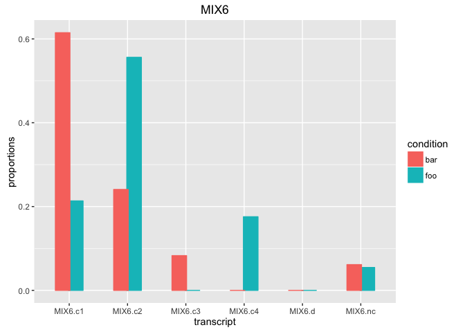

A variation of the above is to plot the mean fragment counts instead of the proportions:


```r
# Absolute expression changes for all the transcripts of the "MIX6" gene.
# The ERROR BARS represent 2 standard deviations from the mean count across replicates.
plot_gene(mydtu, "MIX6", vals="counts")
```

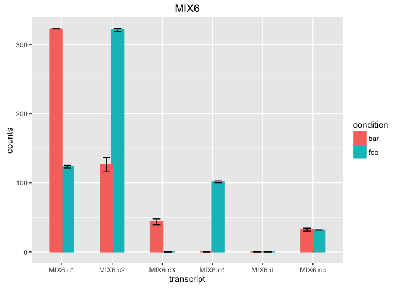

The two versions of the plot are best interpreted together, as no expression normalisation is carried out by `rats`.


### Plots of overall run

Our usual simulated dataset is too small to properly demonstrate what these plots typically would look like.
So each one is accompanied by an image of the same plot created with a real and much larger dataset.

Several of these plots are **likely to display warnings** about missing or non-finite values. These are due to the 
presence of `NA` in the tables, for reasons already discussed in the previous sections, and can be ignored.

Possibly the most common plot in differential expression is the volcano plot, which plots the effect size against 
the statistical significance. As it is difficult to define a single p-value and a single effect size at the gene level,
the volcano can only be plotted at the transcript level.


```r
# Proportion change VS significance.
plot_overview(mydtu, type="volcano")
```

```
## Warning: Removed 11 rows containing missing values (geom_point).
```

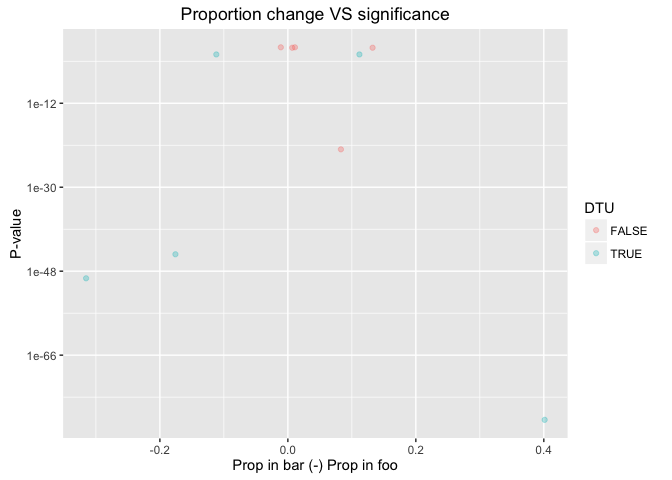

And this is what it looks like on a larger dataset:
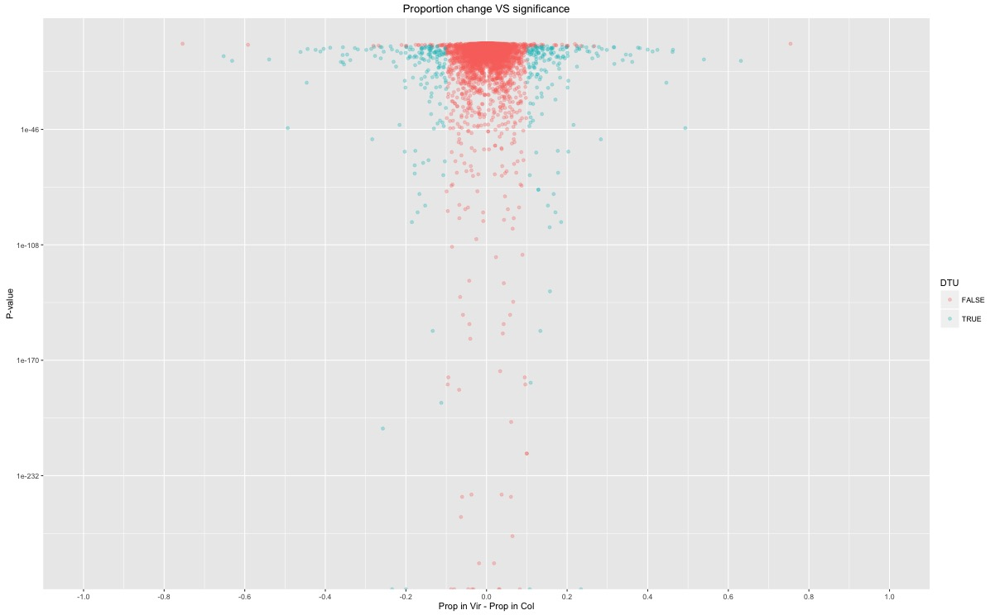

The next command plots the largest change in proportion seen within each gene, against the number of genes showing 
such change. This is a way to inspect what effect sizes are present in the data. As an additional layer of information,
they are colour-coded by their DTU call.


```r
# Distribution of maximum proportion change.
plot_overview(mydtu, type="maxdprop")
```

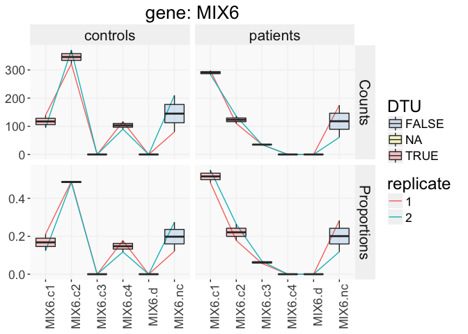

And this is what it looks like on a larger dataset:
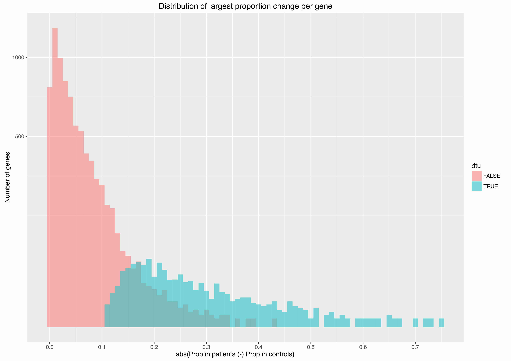

As mentioned before, bootstrapping provides a measure of confidence. This confidence in not taken into account
for the DTU calls. It is therefore useful to plot its potential influence. The following two plots show how
different confidence thresholds would affect the number of DTU positive calls.


```r
# Transcript-level confidence threshold VS. number of DTU positive calls.
plot_overview(mydtu, type="transc_conf")
```

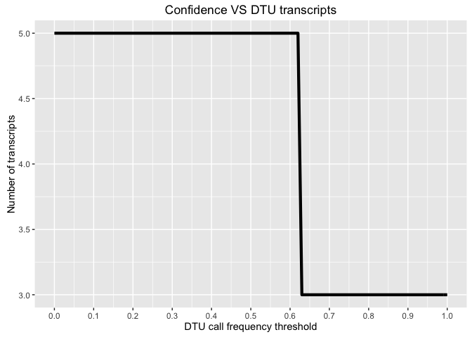

And this is what it looks like on a larger dataset:
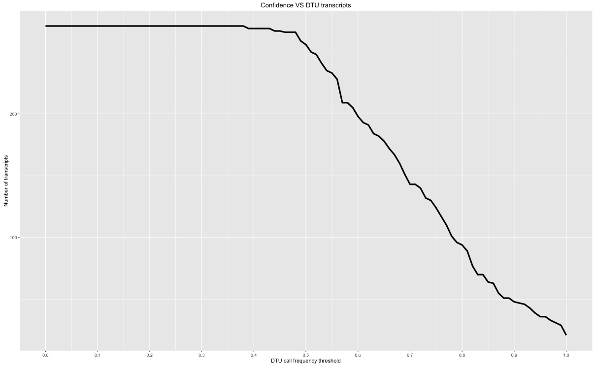


```r
# Gene-level confidence threshold VS. number of DTU positive calls.
plot_overview(mydtu, type="gene_conf")
```

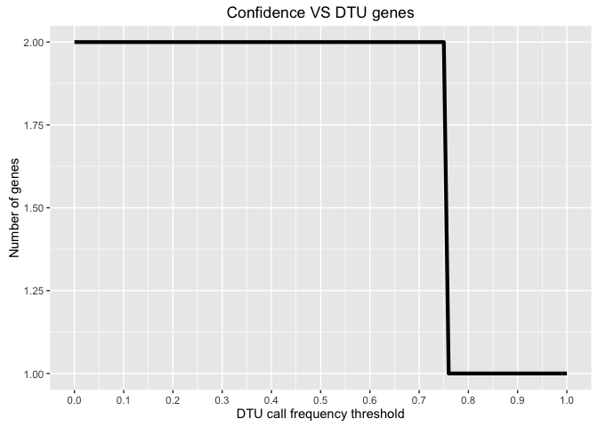

And this is what it looks like on a larger dataset:


### Plot customisation

You can save any of the plots as a `ggplot2` object and use [ggplot2](http://ggplot2.org) manipulations on it, such as changing the axis scales.
Other `ggplot2` customisations include the axis tickmarks, axis values, labels, titles, colours... Consult the [ggplot2](http://ggplot2.org)
documentation for more help on these.


```r
library(ggplot2)

myplot <- plot_overview(mydtu, "volcano")
myplot  # display
```

```
## Warning: Removed 11 rows containing missing values (geom_point).
```

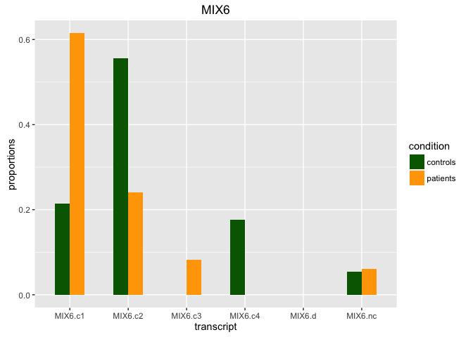

```r
# Change scale of y axis to linear. 
myplot2 <- myplot + scale_y_continuous(trans = "identity")
```

```
## Scale for 'y' is already present. Adding another scale for 'y', which
## will replace the existing scale.
```

```r
myplot2
```

```
## Warning: Removed 11 rows containing missing values (geom_point).
```

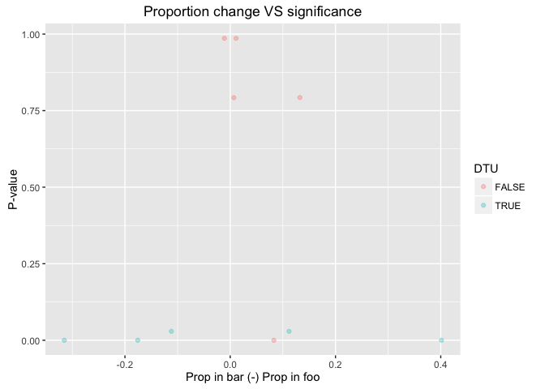


## Advanced options


### Thresholds

Three thresholds can be set in `rats`.


```r
# Calling DTU with custom thresholds.
mydtu <- call_DTU(sim$slo, sim$annot, "foo", "bar", p_thresh = 0.01, 
                  count_thresh = 10, dprop_thresh = 0.25)
```

1. `p_thresh` - Significance level. P-values below this will be considered significant. 0.05 is a very permissive value.
2. `count_thresh` - At least one of the two conditions needs to exceed this number of fragments per sample for the transcript 
to be considered. Low counts have high uncertainty and low significance. Removing such entries from the analysis when both 
conditions are low-count improves the confidence in the predictions of the remaining transcripts, and reduces 
computation time. the reason this threshold requires only one condition to meet it is that enforcing it on both conditions 
would erroneously disqualify transcripts that may be silenced in one of the two conditions but highly expressed in the other.
3. `dprop_thresh` - This is a proxy for biological significance. A transcript's proportion must change by at least this much 
for it to be considered. The need for this is due to the fact that high counts will make even minute differences show up as 
statistically significant, however very small changes are likely to be biologically indifferent.

The default values for all three thresholds are rather lenient. You may want to set them higher. 


### Comparing by different variables

So far, we've mostly compared conditions (`slo$sample_to_covariates[["condition"]]`). Your data could contain other 
variables as well. As we saw in a previous example, our simulated data contains a variable called `batch`, with values
"ba" and "bb", according to the `slo$sample_to_covariates` table.


```r
# Compare by a different variable. In this case "batch".
mydtu <- call_DTU(slo, annot, "ba", "bb", varname= "batch", verbose = FALSE)
```


### Bootstrapping & Confidence in DTU calls

Bootstrapping of the DTU calls is enabled by default and their results were already discussed in the section
about output structure and the example results. Bootstrapping prolongues processing time considerably, 
but it provides a **measure of confidence in the p-values**, so we think it is important. 

Current transcript quantification algorithms such as [kallisto](https://pachterlab.github.io/kallisto/about), 
[salmon](https://combine-lab.github.io/salmon/) and [sailfish](http://www.cs.cmu.edu/~ckingsf/software/sailfish/) use 
probabilistic approaches to estimate transcript abundance. They all have the option to bootstrap their quantifications,
as required by Sleuth. We use these bootstrapped abundance estimations to control for the effect that
the variability in these quantifications has on the DTU calls.

Two parameters control bootrapping of DTU calls on the abundance estimates:

1. `boots` - Although we recommend bootstrapping both gene-level and transcript-level DTU calls, dropping one would reduce
computation time, so the option is provided to allow flexibility for special use cases.
2. `bootnum` - Generally, greater is better but it takes longer. There is also an upper limit that depends on the size of 
your annotation. This is due to R's limit on the maximum size of matrices.


```r
# Bootstrap everything. (default)
mydtu <- call_DTU(sim$slo, sim$annot, "foo", "bar", boots = "both", bootnum = 100)

# Only bootstrap transcript calls.
mydtu <- call_DTU(sim$slo, sim$annot, "foo", "bar", boots = "transc")

# Only bootstrap gene calls.
mydtu <- call_DTU(sim$slo, sim$annot, "foo", "bar", boots = "genes")

# Skip bootstraps.
mydtu <- call_DTU(sim$slo, sim$annot, "foo", "bar", boots = "none")
```


### Test selection

`rats` runs gene-level calls (slower, lower detection threshold, less fine-grained) and transcript-level calls 
(faster, higher detection threshold, more fine-grained). They are complementary and we recommend using them
together, but the option to skip either is provided for special use cases. 
The fields of the skipped test will be filled with `NA`.


```r
# Transcripts only.
mydtu <- call_DTU(sim$slo, sim$annot, "foo", "bar", testmode="transc")
# Genes only.
mydtu <- call_DTU(sim$slo, sim$annot, "foo", "bar", testmode="genes")
```


### Correction for multiple testing

Testing multiple null hypotheses increases the chance of one being falsely rejected. To keep the overall false rate at the 
desired level, the raw p-values must be adjusted. The default adjustment 
method is `BH` (Benjamini-Hochberg). A full list of options is listed in R's `p.adjust.methods`.


```r
# Bonferroni correction.
mydtu <- call_DTU(slo, annot, "foo", "bar", correction = "bonferroni")
```


### Input structure flexibility

`rats` needs to pull information from different fields of the sleuth object and the annotation. For flexibility you can 
change the names of these fields.


```r
# Lets create some input with custom field names. The data is exactly the same as before.
sim <- sim_sleuth_data(varname="mouse", cnames=c("Splinter", "Mickey"), COUNTS_COL="the-counts", 
                       TARGET_COL="transcript", PARENT_COL="gene", BS_TARGET_COL = "trscr")
print( sim$slo$sample_to_covariates )
```

```
##      mouse batch
## 1 Splinter    ba
## 2   Mickey    ba
## 3 Splinter    bb
## 4   Mickey    bb
```

```r
print( head(sim$slo$kal[[1]]$bootstrap[[1]]) )
```

```
##      trscr the-counts
## 1      LC1          3
## 2     NIA1        333
## 3     NIA2        666
## 4   1A1N-1         10
## 5   1A1N-2         20
## 6 1D1C:one          0
```

```r
print( head(sim$annot) )
```

```
##   transcript gene
## 1      NIB.1  NIB
## 2     1A1N-2 1A1N
## 3   1D1C:one 1D1C
## 4   1D1C:two 1D1C
## 5     1B1C.1 1B1C
## 6     1B1C.2 1B1C
```

With the field names changed, we need to tell `rats` where to find the data:


```r
# Call DTU on data with custom field names.
mydtu <- call_DTU(sim$slo, sim$annot, "Splinter", "Mickey", varname="mouse", 
                  TARGET_COL="transcript", PARENT_COL="gene", 
                  COUNTS_COL="the-counts", BS_TARGET_COL="trscr", verbose = FALSE)

# The output structure will always use the same field names, regardless of 
# what the input field names are.
print( names(mydtu$Transcripts) )
```

```
##  [1] "target_id"  "parent_id"  "DTU"        "gene_DTU"   "meanA"     
##  [6] "meanB"      "stdevA"     "stdevB"     "sumA"       "sumB"      
## [11] "totalA"     "totalB"     "elig_xp"    "elig"       "propA"     
## [16] "propB"      "Dprop"      "elig_fx"    "pval"       "pval_corr" 
## [21] "sig"        "boot_freq"  "boot_mean"  "boot_stdev" "boot_min"  
## [26] "boot_max"   "boot_na"
```

* `varname` - The field name in `slo$sample_to_covariates` where the desired condition names are listed.
* `TARGET_COL` - The name of the field holding the transcript identifiers in the annotation dataframe.
* `PARENT_COL` - The name of the field holding the respective gene identifiers in the annotation dataframe.
* `COUNTS_COL` - The name of the field holding the estimated counts in the sleuth object's bootstrap tables.
* `BS_TARGET_COL` - The name of the field holding the transcript identifiers in the sleuth object's bootstrap tables.


## Annotation discrepancies

The results sections mentioned the possibility that some transcripts/genes may be missing altogether from either the
annotation or the sleuth object. This is likely to be caused by use of different annotation versions during different
stages of the analysis. This is generally a **bad idea**, as there is no guarantee (at least for some annotations)
that the transcript identification codes will remain consistent between annotation versions. `rats` will not provide 
any warning about this, and will carry out the DTU calls in the most sensible way possible, assuming that the
intersection of transcript identifications between the sleuth data and annotation dataframe are consistent. All
internal operations and the output will be based on the annotation dataframe provided:

* Any transcripts/genes present in the counts data but missing from the annotation will be ignored completely and 
will not show up in the output.
* Any transcript/gene present in the annotation but missing from the count data will be padded with 
zero counts throughout and will be included in the output.
* If the samples appear to use different annotations from one another, `rats` will abort.


# Contact information

The rats R package was developed within [The Barton Group](http://www.compbio.dundee.ac.uk) at [The University of Dundee](http://www.dundee.ac.uk)
by Dr. Kimon Froussios, Dr. Kira Mourao and Dr. Nick Schurch.

To **report problems** or **ask for assistance**, please raise a new issue [on the project's support forum](https://github.com/bartongroup/Rats/issues).
Providing a *reproducible working example* that demonstrates your issue is strongly encouraged to help us understand the problem. Also, be sure 
to **read the vignette(s)**, and browse/search the support forum before posting a new issue, in case your question is already answered there.

Enjoy!
